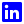

### Me chamo Markus Luan de Brito Sousa Pinheiro

Sou apaixonado por jogos e curioso desde pequeno, e isso me motivou a me dedicar a aprender a programar desde os 13 anos. Comecei a programar de fato aos 16 anos, e atualmente possuo 27 anos. 

Em Novembro de 2022, abri meu MEI (MkgCriações) e atualmente tanto presto serviços como programador, desenvolvedor de jogos e tecnico de informatica. Como também atuo como programador em um escritório de Contabilidade, desenvolvendo bots de automações utilizando a linguagem Python.

Para saber mais sobre mim consulte o [meu curriculo](https://mkgcriacoes.com.br/curriculo/), que está hospedado em meu site!

Também faço reviews e recomendações de produtos: [Produtos que recomendo](https://recomendacoes.mkgcriacoes.com.br/)

<!-- Removendo temporariamente por estar a um tempo sem postar repositorios publicos

!-->

## Programa que considero o melhor que desenvolvi

## Conhecimentos

    
    
    
    
    
    
    
    
    
    
    
    
    
    
    
    

## Aprendendo

    
    
    

## Redes Sociais

    
    
    

